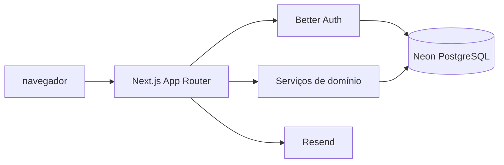
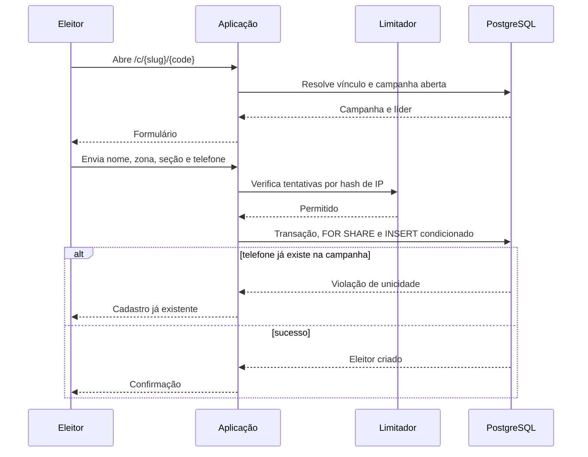
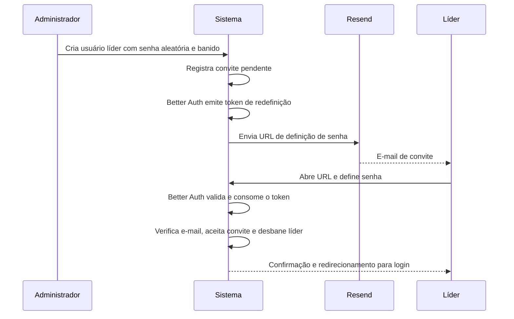

# SDD: Sistema de Cadastro Eleitoral

**Status:** Proposto, aguardando aprovação para planejamento da implementação
**Data:** 28 de agosto de 2026
**Idioma da interface:** Português do Brasil (`pt-BR`)
**Fuso horário de apresentação:** `America/Sao_Paulo`
**Base técnica:** `michaelshimeles/nextjs-starter-kit`, commit `6b6deeb`, após atualização obrigatória das dependências vulneráveis

## 1. Resumo

Este documento define o desenho de um sistema para campanhas eleitorais cadastrarem eleitores por links individuais de líderes. Cada líder poderá atuar em várias campanhas e terá um link distinto por campanha. O eleitor preencherá Nome, Zona, Seção e Telefone; o líder responsável será determinado pelo link e não poderá ser alterado no formulário.

O sistema terá dois perfis internos:

- Administrador: gerencia campanhas, líderes, vínculos, eleitores e exportações.
- Líder: compartilha seus links e consulta somente os eleitores cadastrados por meio deles.

A aplicação será adaptada do starter existente. Serão preservadas as escolhas arquiteturais Next.js, React, TypeScript, Tailwind CSS, shadcn/ui, Better Auth, Drizzle ORM e PostgreSQL, mas não as versões vulneráveis atualmente presentes no lockfile. Recursos SaaS sem relação com o domínio eleitoral serão removidos.

## 2. Objetivos

1. Permitir cadastro público de eleitores sem criação de conta.
2. Atribuir cada cadastro a um líder e a uma campanha de forma não editável.
3. Impedir telefone duplicado dentro da mesma campanha.
4. Permitir que o mesmo telefone participe de campanhas diferentes.
5. Oferecer isolamento de dados entre líderes.
6. Oferecer ao administrador filtros, totais, correção, exclusão e CSV.
7. Permitir convites seguros de líderes por e-mail e autenticação por senha.
8. Operar inicialmente com PostgreSQL Neon, inclusive no plano gratuito durante desenvolvimento ou piloto.

## 3. Fora do Escopo

- Disparo de mensagens para eleitores.
- Integração com WhatsApp Business API.
- Importação em massa de eleitores.
- Aplicativo móvel nativo.
- Geolocalização de zonas ou seções.
- Consulta automática aos sistemas do TSE.
- Registro de CPF, título eleitoral, endereço ou intenção de voto.
- Cobranças, assinaturas, IA, chatbot e upload de arquivos.
- Aprovação de líder por autocadastro.
- Consentimento por checkbox no formulário público.
- Exclusão automática por prazo de retenção na primeira versão.
- Reabertura de campanha encerrada.
- Exportação síncrona acima de 100 mil registros.

## 4. Decisões Aprovadas

| Decisão | Resultado |
| --- | --- |
| Atribuição do líder | Link único por líder e campanha |
| Acesso interno | Administradores e líderes |
| Login | E-mail e senha |
| Entrada de líderes | Convite por e-mail |
| Provedor de e-mail | Resend |
| Duplicidade | Bloqueada por telefone dentro da campanha |
| Múltiplas campanhas | Sim |
| Líder em múltiplas campanhas | Sim |
| Painel | Filtros, totais e CSV |
| Proteção pública | Validação, campo-isca e limite básico de tentativas |
| Consentimento explícito | Não incluir checkbox nesta versão |
| Estratégia do starter | Adaptar e remover módulos sem uso |

## 5. Atores e Permissões

### 5.1 Administrador

O administrador poderá:

- Criar, editar, abrir e encerrar campanhas.
- Criar convites, reenviar convites e desativar líderes.
- Associar um líder a várias campanhas.
- Ativar, revogar e regenerar links de cadastro.
- Consultar todos os eleitores.
- Filtrar eleitores por campanha, líder, zona e seção.
- Pesquisar por nome ou telefone.
- Corrigir e excluir cadastros.
- Exportar o resultado filtrado em CSV.

O administrador não poderá excluir definitivamente uma campanha que possua eleitores. A campanha será encerrada para preservar integridade referencial.

### 5.2 Líder

O líder poderá:

- Entrar com e-mail e senha após aceitar o convite.
- Visualizar as campanhas às quais está associado.
- Copiar ou compartilhar seu link de cada campanha.
- Visualizar totais e eleitores originados somente por seus próprios links.
- Filtrar e pesquisar dentro do próprio escopo.
- Exportar CSV somente dos próprios eleitores.

O líder não poderá criar campanhas, convidar usuários, editar eleitores, excluir eleitores nem acessar dados de outro líder.

### 5.3 Eleitor

O eleitor poderá:

- Acessar um link público válido.
- Visualizar a campanha e o nome do líder responsável.
- Enviar Nome, Zona, Seção e Telefone.
- Receber confirmação de sucesso ou orientação em caso de erro.

O eleitor não terá conta nem acesso ao painel.

## 6. Requisitos Funcionais

### RF-01: Configuração inicial

- Não haverá rota web de bootstrap.
- O primeiro administrador será criado uma única vez com o comando oficial do plugin Admin do Better Auth: `npx auth@latest create-admin --email <email> --name <nome> --role admin`.
- O comando será executado somente por operador com acesso ao ambiente e ao banco.
- Depois do bootstrap, toda criação de usuário ocorrerá por uma ação autenticada de administrador.
- A operação será registrada em procedimento operacional, mas a senha nunca será colocada em arquivo versionado.

### RF-02: Autenticação

- O sistema utilizará Better Auth atualizado, plugin Admin e e-mail/senha com `enabled: true`, `disableSignUp: true`, mínimo de 12 e máximo de 128 caracteres.
- O endpoint público `/api/auth/sign-up/email` permanecerá desabilitado; remover a página de cadastro não será considerado proteção suficiente.
- O papel será atribuído exclusivamente pelo plugin Admin ou por serviço server-only e nunca será aceito do cliente.
- O plugin Admin usará controle de acesso customizado com os papéis `admin` e `leader` somente no servidor. Nenhum endpoint HTTP `/api/auth/admin/*` será exposto pelo catch-all de autenticação e o cliente não instalará `adminClient`.
- Ações próprias da aplicação autenticarão e autorizarão o administrador, então chamarão APIs server-only do Better Auth sem encaminhar headers ou permissões vindas do navegador. Impersonação, exclusão de usuário, troca de papel, banimento direto, troca direta de e-mail e definição administrativa de senha não terão endpoint público.
- O POST HTTP direto de `/api/auth/reset-password` também será bloqueado. Formulários de convite e recuperação chamarão `completePasswordReset`, uma action server-only que coordena o lock e então invoca `auth.api.resetPassword` sem encaminhar o request.
- A recuperação de senha será enviada via Resend.
- Redefinir a senha usará `revokeSessionsOnPasswordReset: true`.
- Desativar um líder será uma operação server-only em uma única `db.transaction`, sem compor `auth.api.banUser` com transação separada. Ela bloqueará campanhas e vínculos em ordem determinística, marcará `user.banned = true`, excluirá as sessões e tornará inativos todos os vínculos do líder.
- A autorização consultará o estado atual da conta no servidor; o cache de sessão em cookie ficará desabilitado para que bloqueios sejam imediatos.

### RF-03: Convite de líder

- O administrador informará nome e e-mail do líder.
- A ação server-only `inviteLeader` validará a sessão administrativa e chamará `auth.api.createUser` sem encaminhar o request ou headers do navegador, criando `leader` com senha aleatória de 256 bits, nunca exibida, e conta inicialmente banida.
- O usuário criado receberá `banReason = 'pending-invite'`. A ação será idempotente: se falhar após criar o usuário, uma nova execução retomará o convite desse mesmo usuário. Banimentos com outro motivo não serão reutilizados.
- A aplicação criará o registro de convite e solicitará ao Better Auth um token de redefinição de senha com validade de 48 horas.
- `resetPasswordTokenExpiresIn` será configurado em `172800` segundos. Convite e recuperação de senha terão a mesma validade de 48 horas nesta versão.
- O callback `sendResetPassword` enviará uma mensagem de convite via Resend quando existir convite pendente; nos demais casos enviará a mensagem normal de recuperação.
- O link usará `/convite?token={betterAuthToken}` e será gerenciado pelo Better Auth, sem implementação própria de hash de senha ou token de credencial.
- O Better Auth consumirá o token e atualizará a senha antes de chamar `onPasswordReset`. O callback será idempotente e, em transação própria, marcará o convite como aceito, verificará o e-mail e desbanirá o líder. Se o callback falhar, o usuário permanecerá banido e um novo envio permitirá concluir o fluxo.
- Emissão e reenvio serão serializados por usuário com `pg_advisory_lock` em conexão PostgreSQL dedicada, liberada em `finally`. Sob esse lock, o serviço removerá de `verification` registros não consumidos com prefixo `reset-password:` e `value` igual ao ID do usuário, manterá versão 1 na emissão inicial ou incrementará `deliveryVersion` somente no reenvio e então solicitará um novo token.
- O fluxo público comum de recuperação retornará resposta neutra sem emitir token quando a conta estiver banida por `pending-invite`; somente `inviteLeader` e `resendLeaderInvite` poderão emitir tokens nesse estado.
- `completePasswordReset` localizará o usuário pelo registro `verification`, adquirirá o mesmo advisory lock, relerá token e convite e somente então chamará o reset server-only. O reenvio, sob o lock, será recusado se o convite já tiver sido aceito.
- O identificador do lock será um inteiro assinado de 64 bits derivado dos primeiros oito bytes de SHA-256 do `userId`, com o mesmo algoritmo em emissão, reenvio e consumo.
- Retry dentro da mesma execução reutilizará exatamente versão, token, URL, corpo e chave de idempotência. Se esses dados não estiverem mais disponíveis ou um novo token for emitido, a operação será um reenvio, com nova `deliveryVersion` e nova chave.
- Teste concorrente cobrirá reenvio contra reenvio e reenvio contra consumo, garantindo um único estado final válido.
- O GET do convite não terá efeitos; o consumo ocorrerá somente no POST de redefinição.
- Haverá no máximo um convite pendente por e-mail, com unicidade sem distinção entre maiúsculas e minúsculas.
- E-mail de administrador, líder ativo ou líder banido por motivo diferente de `pending-invite` não poderá receber convite. Reativação de líder desativado ficará fora do MVP.

### RF-04: Campanhas

- Uma campanha terá nome, slug, descrição opcional e estado.
- Os estados serão `draft`, `open` e `closed`.
- A única sequência permitida será `draft -> open -> closed`; `closed` será terminal.
- O slug poderá mudar em `draft` e será imutável a partir da primeira transição para `open`.
- `openedAt` será preenchido uma única vez na abertura; `closedAt` será preenchido uma única vez no encerramento.
- Somente campanhas `open` aceitarão cadastros.
- Encerrar uma campanha invalidará imediatamente todos os seus formulários públicos.

### RF-05: Vínculo entre campanha e líder

- Cada par campanha/líder terá um único vínculo ativo.
- O vínculo terá um código público aleatório com no mínimo 128 bits de entropia.
- A URL pública será `/c/{campaignSlug}/{publicCode}`.
- Revogar ou regenerar o código invalidará imediatamente o link anterior.
- O código poderá ser armazenado em texto porque foi criado para distribuição pública, mas deverá ser imprevisível.

### RF-06: Cadastro público

- O formulário exibirá o nome da campanha e o nome do líder.
- Nome, Zona, Seção e Telefone serão obrigatórios.
- O líder não será um campo editável.
- O servidor resolverá campanha e líder novamente a partir da URL antes de gravar.
- O cadastro será executado em transação PostgreSQL. O serviço bloqueará, nesta ordem, as linhas de `campaign`, `campaign_leader` e `user` com `SELECT ... FOR SHARE`, relerá estado, vínculo e banimento e somente então fará o `INSERT`. Encerramento, revogação, regeneração e desativação atualizarão essas mesmas linhas seguindo a mesma ordem global. Um `INSERT ... SELECT` condicionado será defesa adicional, não a única garantia concorrente.
- O formulário terá um campo-isca invisível para robôs.
- A confirmação não exibirá telefone, zona ou seção.

### RF-07: Validação

- Nome: texto normalizado, entre 2 e 120 caracteres.
- Zona: somente dígitos, entre 1 e 4 caracteres.
- Seção: somente dígitos, entre 1 e 4 caracteres.
- Telefone: aplicar Unicode NFKC, rejeitar letras, remover espaços e pontuação, remover `+55` ou `55` somente quando o restante tiver 10 ou 11 dígitos e remover um único prefixo `0` somente quando o restante tiver 10 ou 11 dígitos.
- Prefixos de operadora não serão aceitos; após normalização o telefone terá exatamente 10 ou 11 dígitos, incluindo DDD.
- A máscara visual não fará parte do valor persistido.
- Cadastro, edição, busca e restrição única usarão a mesma função canônica de normalização.
- Todas as regras serão executadas novamente no servidor com Zod.

### RF-08: Duplicidade

- O banco terá restrição única composta por campanha e telefone normalizado.
- Um telefone repetido na mesma campanha será recusado.
- O mesmo telefone poderá ser cadastrado em outra campanha.
- A restrição do banco será a proteção final contra envios simultâneos.

### RF-09: Consulta e filtros

- A tabela será paginada no servidor.
- O tamanho padrão será 25 registros e o máximo será 100.
- Os filtros serão campanha, líder, zona e seção.
- A busca aceitará nome ou telefone normalizado.
- Ordenação padrão: cadastro mais recente primeiro.
- Todos os filtros serão combináveis.
- A resposta incluirá `totalFiltered`, calculado sobre todo o conjunto autorizado e filtrado, independentemente da página.
- O dashboard administrativo exibirá total geral, total por campanha aberta e total por líder; o dashboard do líder exibirá os mesmos agregados restritos aos próprios vínculos.
- Filtros sem resultado retornarão total zero e tabela vazia, sem erro.

### RF-10: Edição e exclusão

- Somente o administrador poderá corrigir Nome, Zona, Seção e Telefone.
- A edição respeitará a unicidade de telefone por campanha.
- A exclusão de eleitor será definitiva após confirmação explícita.
- O evento de alteração ou exclusão será registrado sem copiar os dados pessoais para o log de auditoria.

### RF-11: Exportação CSV

- O CSV respeitará exatamente os filtros e o escopo do usuário.
- As colunas serão Nome, Zona, Seção, Telefone, Líder, Campanha e Data do cadastro.
- O arquivo utilizará UTF-8 com BOM, separador ponto e vírgula e escaping compatível com RFC 4180.
- Após ignorar espaços e caracteres de controle iniciais, valores iniciados por `=`, `+`, `-` ou `@` serão prefixados com apóstrofo.
- A data será apresentada em `dd/MM/yyyy HH:mm` no fuso `America/Sao_Paulo`.
- A exportação usará cursor/stream PostgreSQL, `Cache-Control: no-store` e `Content-Disposition: attachment`.
- O limite síncrono será 100 mil registros. Acima disso, o usuário deverá restringir os filtros; exportação assíncrona ficará fora da primeira versão.

### RF-12: Compartilhamento

- O painel oferecerá ação para copiar o link.
- O painel oferecerá ação para abrir o compartilhamento do WhatsApp com mensagem predefinida.
- Não haverá envio automático ou armazenamento de credenciais do WhatsApp.

## 7. Requisitos Não Funcionais

### 7.1 Segurança

- Toda mutação e consulta privada validará a sessão e a permissão no servidor.
- Middleware será usado para redirecionamento, não como única barreira de autorização.
- Senhas serão tratadas exclusivamente pelo Better Auth.
- Convites usarão os tokens de redefinição gerenciados pelo Better Auth; a aplicação não persistirá token de convite próprio.
- Segredos existirão apenas em variáveis de ambiente.
- Respostas de login e recuperação não confirmarão a existência do e-mail.
- CSV será gerado no servidor e nunca receberá um filtro de líder confiado diretamente do cliente.
- Nome e telefone não serão enviados a analytics nem incluídos em logs.
- Produção exigirá HTTPS, fornecido pelo ambiente de hospedagem.
- Páginas com token usarão `Referrer-Policy: no-referrer`, `Cache-Control: no-store` e não carregarão recursos de terceiros.
- Caminhos contendo token serão removidos ou redigidos dos logs da aplicação.
- `npm audit --omit=dev` não poderá apresentar vulnerabilidades altas ou críticas antes de merge ou publicação.

### 7.2 Privacidade

- O formulário exibirá aviso curto de finalidade e link para a política de privacidade.
- Não haverá checkbox de consentimento por decisão do solicitante.
- A política deverá identificar controlador, operadores, finalidade, base legal, transferências internacionais, canal para direitos do titular, tratamento de menores, resposta a incidentes e prazo de retenção.
- A primeira versão terá exclusão manual pelo administrador e não executará expurgo automático.
- A publicação ficará bloqueada até o responsável jurídico documentar a hipótese legal aplicável aos dados potencialmente sensíveis, aprovar a política, definir retenção concreta e concluir um Relatório de Impacto à Proteção de Dados.
- Se a base legal escolhida exigir consentimento, a decisão de não usar checkbox deverá ser revisada antes da publicação.

### 7.3 Disponibilidade

- O sistema deverá responder com página estável quando o banco ou Resend estiver indisponível.
- Falha de e-mail não deverá consumir um convite como aceito.
- O plano gratuito Neon é aceito para desenvolvimento e piloto.
- Produção eleitoral deverá usar plano com capacidade e disponibilidade compatíveis; o plano Neon Free suspende o banco ao exceder limites e não oferece SLA.
- Vercel Hobby não será considerado destino oficial da campanha por ser restrito a uso pessoal e não comercial.

### 7.4 Desempenho

- Listagens serão paginadas e filtradas no PostgreSQL.
- Índices atenderão telefone, campanha, líder, zona, seção e data.
- A primeira carga pública não dependerá de bibliotecas de gráficos ou chat.
- Meta de resposta para cadastro: p95 inferior a 1 segundo, excluindo inicialização após scale-to-zero.
- Meta de resposta para listagem: p95 inferior a 1 segundo com até 500 mil eleitores e filtros indexados.
- Exportações de até 100 mil registros serão transmitidas em streaming sem carregar o arquivo completo na memória da função.

### 7.5 Dependências e qualidade da base

- Antes de qualquer feature, remover dependências SaaS sem uso e atualizar no mínimo para Next.js `15.5.24`, Better Auth `1.6.22` e Drizzle ORM `0.45.2`, ou versões posteriores compatíveis e sem alertas altos/críticos.
- O projeto permanecerá na linha Next.js 15 durante esta entrega para evitar migração de framework não relacionada ao domínio.
- `typescript.ignoreBuildErrors` será removido e `reactStrictMode` será habilitado.
- `db/schema.ts` será a única fonte do esquema; `auth-schema.ts` será removido.
- Como o repositório foi clonado sem banco de produção associado, a migração SaaS existente será substituída por uma baseline limpa do sistema eleitoral.
- A baseline executará `CREATE EXTENSION IF NOT EXISTS citext` antes de criar tabelas com esse tipo.
- O driver `neon-http` será substituído por `drizzle-orm/node-postgres` com `pg.Pool` e URL pooled do Neon, permitindo transações interativas.
- CI executará lint, TypeScript, unitários, integração PostgreSQL, E2E, build e auditoria de dependências.

### 7.6 Acessibilidade

- Campos terão `label`, instrução e erro associados programaticamente.
- O foco será movido para o resumo de erros após submissão inválida.
- Estados de carregamento e sucesso serão anunciados com `aria-live`.
- Contraste mínimo seguirá WCAG 2.2 AA.
- Todo fluxo deverá funcionar por teclado.
- Alvos de toque terão ao menos 44 por 44 pixels.

### 7.7 Responsividade

- O cadastro público será desenhado primeiro para celulares com largura mínima de 320 pixels.
- Tabelas privadas usarão cartões ou colunas prioritárias em telas pequenas.
- Filtros permanecerão acessíveis sem rolagem horizontal obrigatória.

## 8. Arquitetura



### 8.1 Camadas

| Camada | Responsabilidade |
| --- | --- |
| Rotas e páginas | Renderização, parâmetros de URL e composição de componentes |
| Componentes | Formulários, tabelas, filtros e feedback visual |
| Server actions/handlers | Validação de entrada, sessão, autorização e respostas tipadas |
| Serviços de domínio | Regras de campanha, vínculo, eleitor, convite e exportação |
| Repositórios Drizzle | Consultas e transações PostgreSQL via `node-postgres` pooled |
| Integrações | Better Auth e Resend |

As páginas não acessarão tabelas diretamente quando a operação contiver regra de autorização ou negócio. Essas regras ficarão em serviços server-only com interfaces testáveis.

### 8.2 Fluxo de cadastro



### 8.3 Fluxo de convite



## 9. Modelo de Dados

### 9.1 `user`

| Campo | Tipo | Regra |
| --- | --- | --- |
| `id` | text | PK, gerenciado pelo Better Auth |
| `name` | text | obrigatório |
| `email` | citext | obrigatório e único sem distinção de caixa |
| `emailVerified` | boolean | padrão `false` |
| `image` | text | opcional |
| `role` | text | `admin` ou `leader`, gerenciado pelo plugin Admin |
| `banned` | boolean | padrão `false`, gerenciado pelo plugin Admin |
| `banReason` | text | opcional |
| `banExpires` | timestamptz | opcional |
| `createdAt` | timestamptz | obrigatório |
| `updatedAt` | timestamptz | obrigatório |

As tabelas `session`, `account` e `verification` seguirão exatamente o esquema gerado pela versão instalada do Better Auth e do plugin Admin. `session` incluirá `impersonatedBy` por exigência do esquema, mas o controle de acesso negará o endpoint de impersonação independentemente da interface. Instantes serão persistidos em UTC com `timestamptz`.

O rate limit do Better Auth usará a tabela `rateLimit` declarada em `db/schema.ts` conforme a versão fixada: `id` text PK, `key` text único, `count` integer e `lastRequest` bigint. Essa tabela será distinta de `registration_rate_limit`.

### 9.2 `campaign`

| Campo | Tipo | Regra |
| --- | --- | --- |
| `id` | uuid | PK |
| `name` | varchar(120) | obrigatório |
| `slug` | varchar(140) | obrigatório, único |
| `description` | text | opcional |
| `status` | enum | `draft`, `open`, `closed` |
| `createdBy` | text | FK `RESTRICT` para `user.id` |
| `openedAt` | timestamptz | opcional, imutável após preenchimento |
| `closedAt` | timestamptz | opcional, imutável após preenchimento |
| `createdAt` | timestamptz | obrigatório |
| `updatedAt` | timestamptz | obrigatório |

As transições serão validadas pelo serviço de domínio. Checks garantirão `openedAt` para estados `open/closed` e `closedAt` apenas para `closed`.

### 9.3 `campaign_leader`

| Campo | Tipo | Regra |
| --- | --- | --- |
| `id` | uuid | PK |
| `campaignId` | uuid | FK `RESTRICT` para campanha |
| `leaderId` | text | FK `RESTRICT` para usuário líder |
| `publicCode` | varchar(64) | único, imprevisível |
| `active` | boolean | padrão `true` |
| `createdAt` | timestamptz | obrigatório |
| `updatedAt` | timestamptz | obrigatório |

Restrições:

- Única composta em `campaignId, leaderId`.
- Única composta em `id, campaignId`, usada como chave candidata pela FK de eleitor.
- Única em `publicCode`.
- Índices em `leaderId` e `campaignId`.

### 9.4 `voter`

| Campo | Tipo | Regra |
| --- | --- | --- |
| `id` | uuid | PK |
| `campaignId` | uuid | parte da FK composta para vínculo campanha/líder |
| `campaignLeaderId` | uuid | parte da FK composta para vínculo campanha/líder |
| `name` | varchar(120) | obrigatório |
| `zone` | varchar(4) | obrigatório |
| `section` | varchar(4) | obrigatório |
| `phone` | varchar(11) | obrigatório, somente dígitos |
| `createdAt` | timestamptz | obrigatório |
| `updatedAt` | timestamptz | obrigatório |

Restrições:

- Única composta em `campaignId, phone`.
- FK composta `(campaignLeaderId, campaignId)` referenciando `campaign_leader(id, campaignId)` com `ON DELETE RESTRICT`.
- Índices em `campaignLeaderId, createdAt`, `campaignId, createdAt`, `zone` e `section`.

### 9.5 `invitation`

| Campo | Tipo | Regra |
| --- | --- | --- |
| `id` | uuid | PK |
| `userId` | text | FK única `RESTRICT` para usuário líder |
| `email` | citext | obrigatório |
| `status` | enum | `pending`, `accepted`, `revoked` |
| `deliveryVersion` | integer | inicia em 1 e incrementa no reenvio |
| `invitedBy` | text | FK `RESTRICT` para administrador |
| `expiresAt` | timestamptz | espelha a validade do token atual |
| `acceptedAt` | timestamptz | opcional |
| `revokedAt` | timestamptz | opcional |
| `createdAt` | timestamptz | obrigatório |
| `updatedAt` | timestamptz | obrigatório |

Um índice parcial único em `lower(email)` para `status = 'pending'` garantirá um convite pendente por e-mail. Tokens e hashes de senha permanecerão exclusivamente nas tabelas e primitivas do Better Auth.

### 9.6 `registration_rate_limit`

| Campo | Tipo | Regra |
| --- | --- | --- |
| `bucketHash` | char(64) | PK, HMAC de rede, vínculo e janela |
| `count` | integer | obrigatório, entre 1 e 5 |
| `expiresAt` | timestamptz | obrigatório, indexado |
| `createdAt` | timestamptz | obrigatório |
| `updatedAt` | timestamptz | obrigatório |

Cada janela de dez minutos produzirá um `bucketHash`. Um único `INSERT ... ON CONFLICT DO UPDATE ... WHERE count < 5 RETURNING count` incrementará o contador atomicamente. Ausência de retorno significa limite excedido. Registros expirados serão removidos por rotina agendada.

### 9.7 `audit_event`

| Campo | Tipo | Regra |
| --- | --- | --- |
| `id` | uuid | PK |
| `actorId` | text | FK `RESTRICT` para usuário |
| `action` | varchar(80) | obrigatório |
| `entityType` | varchar(40) | obrigatório |
| `entityId` | text | obrigatório |
| `createdAt` | timestamptz | obrigatório |

O log registrará criação e mudança de campanha, convite, aceite, mudança de papel, desativação de líder, vínculo, revogação/regeneração de link, edição/exclusão de eleitor e exportação. Não armazenará nome, telefone nem cópia integral dos registros alterados. Não haverá APIs de alteração ou exclusão do log; somente administradores poderão consultá-lo. A retenção será de 365 dias.

## 10. Rotas

### 10.1 Públicas

| Rota | Finalidade |
| --- | --- |
| `/` | Redirecionar para login ou painel conforme sessão |
| `/entrar` | Login por e-mail e senha |
| `/esqueci-senha` | Solicitar recuperação |
| `/redefinir-senha` | Definir nova senha por token |
| `/convite?token={token}` | Aceitar convite e definir senha; resposta `no-store` |
| `/c/[campaignSlug]/[publicCode]` | Cadastro público |
| `/privacidade` | Política de privacidade |

### 10.2 Privadas

| Rota | Permissão |
| --- | --- |
| `/dashboard` | admin e líder, conteúdo por perfil |
| `/dashboard/campanhas` | admin |
| `/dashboard/campanhas/[id]` | admin |
| `/dashboard/lideres` | admin |
| `/dashboard/eleitores` | admin e líder com escopo |
| `/dashboard/configuracoes` | admin e líder |
| `/api/eleitores/exportar` | admin e líder com escopo |

## 11. Respostas e Erros

Operações de formulário retornarão um resultado discriminado:

```ts
type ActionResult<T> =
  | { ok: true; data: T }
  | {
      ok: false;
      code:
        | "VALIDATION_ERROR"
        | "UNAUTHENTICATED"
        | "FORBIDDEN"
        | "NOT_FOUND"
        | "CAMPAIGN_CLOSED"
        | "LINK_INACTIVE"
        | "DUPLICATE_PHONE"
        | "RATE_LIMITED"
        | "EMAIL_DELIVERY_FAILED"
        | "INTERNAL_ERROR";
      message: string;
      fieldErrors?: Record<string, string[]>;
    };
```

Mensagens ao usuário serão em português e não incluirão stack traces, SQL, tokens ou detalhes internos.

## 12. Proteção Contra Abuso

- Campo-isca preenchido resultará em resposta neutra sem gravação.
- Cinco tentativas serão permitidas por IP/vínculo a cada dez minutos.
- Em produção Vercel, a origem será o primeiro endereço válido de `x-vercel-forwarded-for`, cabeçalho sobrescrito pelo provedor; cabeçalhos arbitrários não serão aceitos fora de proxy confiável.
- IPv4 usará o endereço completo e IPv6 será reduzido ao prefixo `/64`, evitando contorno por rotação de endereços na mesma rede.
- O IP não será armazenado; rede canônica, vínculo e janela serão combinados por HMAC-SHA-256 com `RATE_LIMIT_SECRET`.
- O incremento será atômico no PostgreSQL, sem sequência separada de contar e inserir.
- O limitador não substituirá a restrição única do banco.
- A resposta `RATE_LIMITED` orientará tentar novamente após dez minutos.
- Cloudflare Turnstile poderá ser introduzido posteriormente se houver abuso real.
- O rate limit do Better Auth usará armazenamento PostgreSQL compartilhado para funcionar entre instâncias serverless.

## 13. E-mail

- Provedor: Resend SDK oficial.
- Variáveis: `RESEND_API_KEY` e `EMAIL_FROM`.
- Produção exigirá domínio de remetente verificado.
- O envio tratará `{ data, error }`.
- Cada entrega terá chave `leader-invite/{invitationId}/{deliveryVersion}`. Um retry técnico reutilizará a mesma chave; um reenvio incrementará a versão e usará nova chave.
- Convite e recuperação terão versões HTML e texto.
- Nenhuma chave será exposta ao navegador.

## 14. Configuração de Ambiente

| Variável | Uso |
| --- | --- |
| `DATABASE_URL` | Conexão PostgreSQL Neon |
| `BETTER_AUTH_SECRET` | Assinatura e proteção da autenticação |
| `NEXT_PUBLIC_APP_URL` | URL canônica da aplicação |
| `RESEND_API_KEY` | Envio de e-mail |
| `EMAIL_FROM` | Remetente verificado |
| `RATE_LIMIT_SECRET` | HMAC do limitador público |

Variáveis de Polar, Google OAuth, OpenAI, Cloudflare R2 e PostHog serão removidas.

## 15. Alterações no Starter

### Preservar

- `app/api/auth/[...all]/route.ts`
- `components/ui/*` necessários ao produto
- `components/provider.tsx`
- `lib/auth-client.ts`
- Estrutura da configuração Next.js, Tailwind e TypeScript

### Substituir ou adaptar

- `lib/auth.ts`
- `lib/auth-client.ts` para habilitar o plugin Admin no cliente
- `db/schema.ts`
- `db/drizzle.ts` para usar `pg.Pool` com URL pooled
- `middleware.ts`
- `next.config.ts` para habilitar Strict Mode e remover `ignoreBuildErrors`
- `app/layout.tsx`
- `app/page.tsx`
- `app/sign-in/page.tsx`
- `app/dashboard/layout.tsx`
- Navegação e conteúdo de `app/dashboard`
- `.env.example`, `README.md` e `package.json`
- `package-lock.json`, após remoção e atualização de dependências

### Remover

- Polar e assinaturas.
- Chat e OpenAI.
- Upload e Cloudflare R2.
- Pricing e páginas SaaS.
- Integrações e logos promocionais do starter.
- PostHog e bibliotecas não utilizadas.
- `auth-schema.ts`, mantendo `db/schema.ts` como fonte única.
- Migração SaaS inicial e metadados, substituídos por baseline eleitoral limpa.

## 16. Estratégia de Testes

### 16.1 Unitários com Vitest

- Normalização e validação do telefone.
- Nome, zona e seção.
- HMAC do limitador.
- Sanitização de CSV.
- Decisões de autorização por perfil.
- Conversão de erros de banco em `ActionResult`.
- Máquina de estados `draft -> open -> closed`.
- Cálculo de totais autorizados e filtrados.

### 16.2 Integração com PostgreSQL de teste

- Telefone único por campanha.
- Mesmo telefone em campanhas diferentes.
- Integridade entre campanha e vínculo do líder.
- Fechamento concorrente ao cadastro sem inserção posterior.
- Revogação concorrente de link sem inserção posterior.
- Escopo de consulta e exportação do líder.
- Consumo único de convite.
- Reenvios concorrentes deixando válido somente o token da maior `deliveryVersion`.
- Corrida entre reenvio e consumo de convite produzindo um único estado final consistente.
- Contador atômico limitado a cinco requisições por janela.
- E-mail único sem distinção entre maiúsculas e minúsculas.
- Desativação de líder revogando sessões e links.

### 16.3 E2E com Playwright

- Login do administrador criado pelo bootstrap CLI.
- Login e recuperação de senha.
- Convite e primeiro acesso do líder.
- Criação, abertura e encerramento de campanha.
- Associação e compartilhamento de link.
- Cadastro público válido.
- Bloqueio de duplicidade.
- Filtros, paginação e CSV.
- Totais globais, filtrados e restritos por perfil.
- Proibição de acesso entre líderes.
- Uso por teclado e comportamento em viewport móvel.
- Bloqueio do endpoint público de cadastro de usuário interno.
- Bloqueio de todos os endpoints HTTP do plugin Admin.
- Bloqueio do POST HTTP direto de reset, preservando o fluxo por action server-only.

## 17. Critérios de Aceite

1. O operador cria o primeiro administrador pelo CLI oficial do Better Auth; `/sign-up/email`, o POST HTTP direto de reset e todos os endpoints HTTP `/api/auth/admin/*` permanecem bloqueados.
2. Um administrador consegue criar uma campanha e transicioná-la de `draft` para `open` e depois `closed`, sem transições reversas.
3. Um administrador consegue convidar um líder via Resend.
4. O líder consegue definir senha e entrar no painel; convite consumido, expirado ou substituído por reenvio não funciona novamente.
5. Desativar um líder encerra suas sessões e links imediatamente.
6. O mesmo líder pode receber links diferentes para campanhas diferentes.
7. O link identifica campanha e líder sem campo editável no formulário.
8. Um eleitor consegue cadastrar Nome, Zona, Seção e Telefone.
9. O mesmo telefone não pode ser cadastrado duas vezes na mesma campanha.
10. O mesmo telefone pode ser cadastrado em campanhas diferentes.
11. Um líder não consegue consultar nem exportar eleitores de outro líder.
12. O administrador consegue filtrar, editar, excluir e exportar eleitores.
13. Totais refletem todo o conjunto autorizado e filtrado, não apenas a página atual.
14. Encerrar a campanha ou revogar um vínculo bloqueia inclusive cadastros concorrentes ainda não gravados.
15. CSV exporta todo o conjunto filtrado até 100 mil linhas, em streaming e com sanitização de fórmulas.
16. Logs e auditoria não contêm nome ou telefone do eleitor.
17. O formulário funciona a partir de 320 pixels e por teclado.
18. `npm run lint`, `npm run typecheck`, unitários, integração, E2E e build terminam sem falhas.
19. `npm audit --omit=dev` não apresenta vulnerabilidades altas ou críticas.

## 18. Implantação

### Piloto

- Aplicação Next.js em ambiente de preview ou hospedagem compatível.
- Neon Free para banco de desenvolvimento/piloto.
- Resend com domínio verificado antes de convidar usuários reais.
- Migrações executadas antes da aplicação receber tráfego.
- O piloto não utilizará dados reais antes da aprovação jurídica dos itens de privacidade.

### Produção

- Plano de hospedagem permitido para uso organizacional.
- Banco com capacidade monitorada e plano de upgrade definido.
- Backup ou snapshot antes de migrações.
- Alertas para falhas de autenticação, banco e e-mail sem payload pessoal.
- Domínio próprio com HTTPS.
- `Referrer-Policy`, `Cache-Control` e redação de tokens em logs validados no ambiente publicado.
- Base legal, RIPD, retenção, tratamento de menores e resposta a incidentes aprovados pelo responsável jurídico.

## 19. Riscos e Mitigações

| Risco | Mitigação |
| --- | --- |
| Excesso de tráfego no plano gratuito | Monitorar limites e migrar antes do período crítico |
| Link público compartilhado fora do público esperado | Link revogável, código imprevisível e limitador |
| Cadastro automatizado | Campo-isca, limite por HMAC de IP e futura adoção de Turnstile |
| Vazamento entre líderes | Escopo aplicado em serviços server-side e testes negativos |
| CSV malicioso | Sanitização contra fórmulas e geração no servidor |
| Concorrência criando duplicados | Índice único no PostgreSQL |
| Fechamento ou revogação concorrente | Transação com bloqueio ordenado das linhas de campanha, vínculo e líder antes da validação e inserção |
| Falha do Resend | Usuário permanece banido, convite pendente e entrega pode ser repetida com idempotência versionada |
| Dados eleitorais sem consentimento explícito | Bloqueio de publicação até definição da base legal, política, retenção e RIPD |
| Dependências do starter exigindo serviços sem uso | Remoção de módulos e variáveis de Polar, IA, upload e analytics |
| Dependências vulneráveis do starter | Atualizações mínimas definidas e auditoria sem achados altos/críticos |
| Exportação excessiva em serverless | Streaming com cursor e limite de 100 mil linhas |

## 20. Condições para Iniciar a Implementação

A implementação poderá começar somente após:

1. Aprovação deste SDD.
2. Criação de um plano de implementação TDD com tarefas e arquivos exatos.
3. Definição, antes da publicação, do nome visual do produto, domínio, remetente Resend e responsável pela política de privacidade.

Esses dados de produção não bloqueiam o desenvolvimento local; durante o desenvolvimento serão usados valores locais seguros e o nome neutro “Gestão Eleitoral”.
